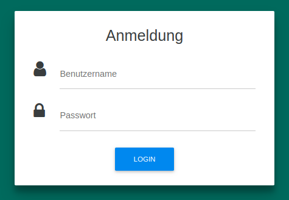
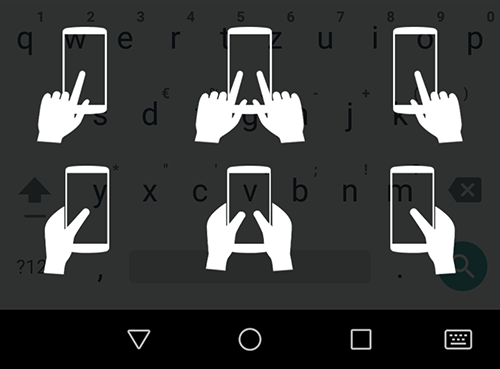

# Language Logger Research App: Backend

Language Logger is a research tool that enables **studies on mobile language use in the wild**. The LanguageLogger Android app can be installed on study participants' smartphones, where it replaces the smartphone's keyboard. **The app logs** when the user tyes words of predefined **word categories** (either just the category name or the raw word), count **word frequencies**, and log the usage of words that match a **regular expression**.

With this on-device language abstraction approach, **typed language on smartphones can be observed in the wild in a privacy-friendly manner**. No raw text data leaves the user's device.
Furthermore it is also possible to log touch data (typing speed, touch positions, ...), used messenger apps, and configure custom keyboard layouts for each study condition.


Please checkout the research papers about this tool for more details:

* [Bemmann, Buschek 2020. LanguageLogger: A Mobile Keyboard Application for Studying Language Use in Everyday Text Communication in the Wild](https://dl.acm.org/doi/pdf/10.1145/3397872)

* [Buschek, Bisinger, Alt 2018. ResearchIME: A mobile keyboard application for studying free typing behaviour in the wild](https://dl.acm.org/doi/abs/10.1145/3173574.3173829)


This GitHub project contains the backend of the research tool LanguageLogger. It is necessary to manage the study configuration, and record the logged data.

The repository for the Android App can be found here:

https://github.com/Flo890/languagelogger-app


# Setup Server
The server consists a web app based on Play Java 2.5.3 and a MySQL Database

## For Development: Deploy locally

### Prerequistities
* jdk 8 (jdk 9 is not supported)

### Step 1: Setup MySQL Server

#### 1.1 Install MySQL (Ubuntu)
* install MySql Server (we are using v5.7.21 in this guide):

    `sudo apt-get install mysql-server`
    
* During the installation proccess you will be asked to define a password for the "root" user. Enter a password and remember it.

* ensure that `character_set_server=utf8mb4` is set in the MySQL config files (for emojis)

#### 1.2 Initialize database and user

* Once finished, type

    `mysql -u root -p`
    
    to enter MySQL server. Enter just defined password for root user.


* Create our Database:
    
    `create database languageloggerdb default character set utf8mb4 default collate utf8mb4_general_ci;`


* Create database user and grant access to newly created database:

1. `create user 'languagelogger'@'localhost' identified by 'G8BCjNk';`

**Note: Do not use the username and password listed here on your system - exchange them with custom ones!**
    
2. `grant all on languageloggerdb.* to 'languagelogger'@'localhost';`
    
3. `flush privileges;`


    
    

### Step 2: Configure, compile and run Play Application

Open the commandline, and navigate into the project directory if you didn't so far:

* `cd languagelogger-backend` 

On Ubuntu we first have to make the activator script runnable...
* `chmod +x activator`

...then you can run the server using
* `./activator run -Dplay.evolutions.db.default.autoApply=true`

On Windows you can usually just run
* `activator run -Dplay.evolutions.db.default.autoApply=true`

* Wait till you see:

     `[info] p.c.s.NettyServer - Listening for HTTP on /0:0:0:0:0:0:0:0:9000`
     
* Open `http://localhost:9000/cms/login` in browser.

* You might see a red warning page, telling you that your database layout does not fit. Hit the "Apply this script now" button to initialize the database layout. **Attention: This will delete all tables and data in `languageloggerdb`!**

* After a short while you should see the login page:

    
    
    The default user is: `LanguageLogger`

    The default password is: `$LL773`
    
### Step 3 (local testing only): Reverse Proxy

Usually you will not be able to access a locally setup backend from an Android smartphone. For development purposes, we suggest to use the reverse proxy ngrok:

* Install [ngrok](https://ngrok.com/) on your local system    
* on the commandline, run `ngrok http 9000` (Where 9000 is the port on which your local LanguageLogger backend is running)
* copy the created ngrok forwarding url, and use it as server url configured in the Android app

### Step 4: Configure LanguageLogger abstraction logic

To quick-start, import the file `demodata/plants-animals-shop-config.sql` into your database:

* `mysql -u languagelogger -p languageloggerdb < demodata/plants-animals-shop-config.sql`

To learn how to configure LanguageLogger for your research study read the Section `Research Configuration` below.

### Additional settings
By editing the file `conf/application.conf` u can modify further settings for example:
* Changing database user and password:
```conf
db.default.username = "<your_username>"
db.default.password = "<your_password>"
```

* Changing Dashboard login:
```conf
dashboard.user = "<your_username>"
dashboard.pwd = "<your_password>"
```


## Production

prerequisites:
jdk 8 (jdk 9 is not supported)

* Setup a mysql database as described in the local deployment area
* clone project
* cd `languagelogger-backend`
* `chmod +x activator`
* `./activator dist` (this generates a languagelogger-1.0-SNAPSHOT.zip in `target/universal`)
* `unzip target/universal/languagelogger-1.0-SNAPSHOT.zip`
* `chmod +x languagelogger-1.0-SNAPSHOT.zip/bin/languagelogger`
* `languagelogger-1.0-SNAPSHOT/bin/languagelogger -Dplay.crypto.secret="researchime" -Dhttps.keyStore="languagelogger-1.0-SNAPSHOT/conf/keystore.jks" -Dhttps.keyStorePassword="researchime" -Dplay.evolutions.db.default.autoApply=true -Dhttp.port=disabled`


# Research Configuration

## General Study Settings

`http://localhost:9000/cms/study`

On this page you have to set the study duration (a default study of 14 days is preconfigured). On the very bottom, you have to choose a keyboard used for this study. Usually you would set it to the same duration as the study.

If you conduct a within-subject study with e.g. two conditions, you could also add one keyboard with e.g. 7 days duration, and a different keyboard with another 7 days.

Setting study name and welcome message is obligatory.

## Keyboards

`http://localhost:9000/cms/keyboards`

On this page you can create and configure keyboards. There are 3 checkboxes at the top:
* `Ask for hand posture` If checked, an overlay will be prompted when the keyboard opens, where the user has to specify which fingers he is currently using for typing



* `Tracking` If NOT checked NO data will be logged at all
* `Anonymize Input Events` If checked, touch events will be stored with obscured data. That means, e.g. the code of a key pressed is not stored (words cannot be reconstructed) in a bigram manner. If this is NOT checked raw touch events will be saved, what might violate participant privacy!

## Word Categorization
### How does it work and why is it useful?
The researcher configures a list of words, each mapped to a category. For each typed word, the app checks whether a category is listed for that word. If yes, an event of that category is logged. Otherwise, an event of category `unknown`is logged. 

For example the words `dog` and `cat` could both be mapped to the category `animal`. If the user types `My cat and dog are good friends` a series of categories like `unknown`,`animal`,`unknown`,`animal`,`unknown`,`unknown`,`unknown` is logged. Thus the research can study how much one is texting about animals, without knowing the precise content or full sentence. 

Each category event is related to a so called "Message Statistics" instance, which is a meta object for each typing session. It holds meta data like timestamps, the target app, character counts, ...

### How to configure it

`http://localhost:9000/cms/categorylists`

The configuration works with physical- logical word lists, for easier updatability.
#### Step 1: Import word -> category mapping
Hit the `Add Category Baselist` button, then you see the config page. Upload a word to category mapping file that looks like the following:
```
[type=word2category]
cat	animal
dog	animal
elephant	animal
fish	animal
horse	animal
tree	plant
flower	plant
grass	plant
bush	plant
```
_demodata/word-categories_plants-and-animals.rime_

Important notes:
* Each line maps one word to one category. Thus, each word should occur only once
* Word and category mus be separated by a Tab (no spaces!)
* Although the backend would support splitted-words (e.g. the word `palm tree`), the app currently does not. Thus you should use only words that "are one" (e.g. `palmtree`)
* Multiple categories for one word are not supported. But there's a good workaround: Specify multiple categories comma-separated. Technically they are treated as one, but you can work with them as multiple in your data preprocessing. (e.g. `dog    animal,pet`).

#### Step 2: Assemble a logical list

A logical list consists of one or multiple physical lists. For example you could have uploaded a (physical) list of dogs, and another (physical) list of cats, and combine them to one logical list `animals`. The advantage: When the dogs list in the future will be updated, you simply re-upload that list.
Only logical lists are actually applied in the app! Without any logical list, no word categorization will happen!

## Word Frequency Counting
### How does it work and why is it useful?
The researcher configures a list of words, whose occurrences should be counted. As only a count table over the full study duration is saved, and only words listed in the configuration (whitelist) are counted, this is way more privacy preserving than equivalent offline analyses that require to log full messages.

### How to configure it
`http://localhost:9000/cms/wordlists`
Equivalent to the Word Categorization, a structure of phyiscal and logical lists is used (read above).

#### Step 1: Import a list of words
It should look like this:
```
[type=words]
walmart
amazon
supermarket
```
_demodata/dictionary-markets.rime_

Important Notes:
* Each line must contain one word
* Although the backend would support splitted-words (e.g. the word `palm tree`), the app currently does not. Thus you should use only words that "are one" (e.g. `palmtree`)
* The matching is case-sensitive

#### Step 2: Assemble a logical list

Only logical lists are actually applied in the app! Without any logical list, no word categorization will happen!


## Regular Expression Matching
### How does it work and why is it useful?

To log e.g. emojis it would be cumbersome to create a list of all existant emojis - they could way easier be detected with a regular expression. For other types of data, e.g. phonenumbers, it would be impossible to create a list of all phonenumbers. Thus, one can configure regular expressions. Each typed word is checked whether it matches the configured regular expressions. If yes, a category event is saved, or optionally the raw word (a.k.a emoji / phonenumber)

### How to configure it
`http://localhost:9000/cms/patternmatchers`

Enter a regular expression, e.g. 
```
[\uD83C-\uDBFF\uDC00-\uDFFF]+
```
_demodata/emojimatcher_

to match the unicode range of emojis.


# The Log Data Structure

TODO